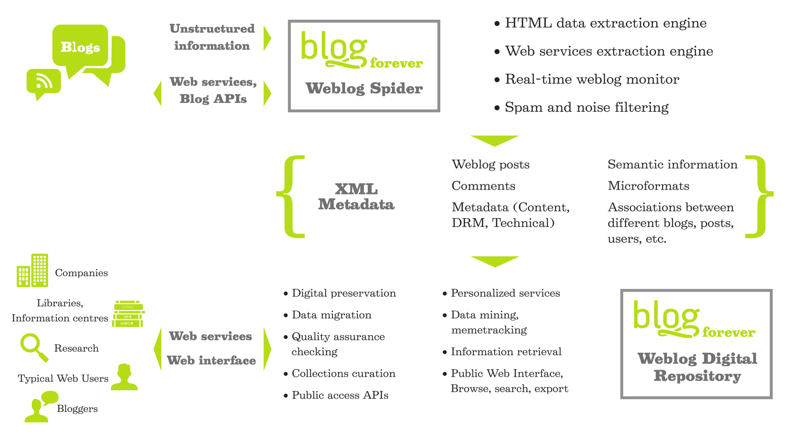
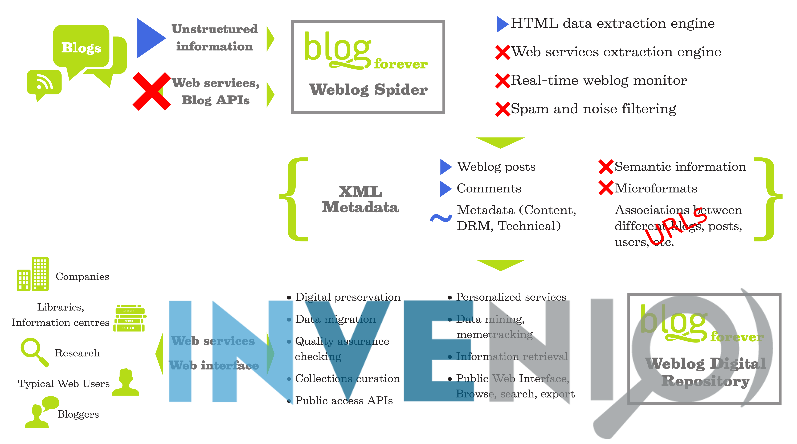

% BlogForever Crawler
% Olivier Blanvillain
% JANUARY 29, 2014

<h2>
#. My internship

#. I didn't like Python

#. The crawler
</h2>

My internship
=============

----------------------------------------------------------

## My background

- Mostly Java and Scala

- Mathematically Inclined

- I like compilers

- Recent interest in functional programming  

    ```bash
        $ cd workspace/crawler/src/
        $ grep -r 'for .* in' | wc -l
        13
        $ grep -r 'lambda' | wc -l
        95
    ```

----------------------------------------------------------

## It started like this...


(^ This is Nikos)

<!--
  goal -> text editor -> get started
  great effect
  highly motivated, feels like mine
-->

----------------------------------------------------------

## And not like this:



<!--
  online on bf.eu
  not: started in 2011
  not: close source version
-->

----------------------------------------------------------

## BTW, here is how it is:



<!--
  no api
  twitter closed
  real time with invenio?
  microformat/semantic: .5%
  links are all URLs
  
  crawler's job
-->

----------------------------------------------------------

## Outline:

- Three months of developement 

- Three months of redaction

- I learned Python somewhere in the process

