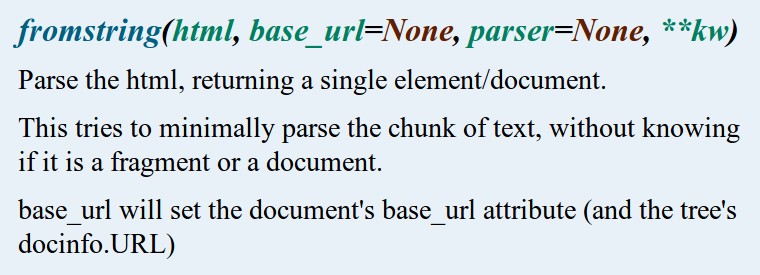

I didn't like Python
====================

----------------------------------------------------------

### What I'm not going to talk about:

- sdtlib documentation

- pip, virtualenv

- byte vs unicode strings

----------------------------------------------------------

### Things that bug me:

- No interfaces  
  ↪ \ *you better like reading source code...*
  
- No type-checking

- Exceptions as control flow  
  ↪ \ *you better like stack traces...*

- Immutability?

----------------------------------------------------------

## Interfaces

### *"We're all consenting adults here"*  

----------------------------------------------------------

# Nope.

----------------------------------------------------------

```python
      def parseHTML(page):
        """Parses a page to an html tree.

        @type  page: string
        @param page: the page to parse
        @rtype: xml.etree.ElementTree.Element
        @return: the root of the html tree
        """
```
  . . .

```python
        try:
          return lxml.html.fromstring(page)
        except (LookupError,
                UnicodeDecodeError,
                lxml.etree.XMLSyntaxError,
                lxml.etree.ParserError): # TBC
          try:
            return soupparser.fromstring(page)
          except Exception:
            return lxml.etree.Element("html")
```

----------------------------------------------------------

### lxml documentation:



----------------------------------------------------------

## Type-checking

### *"If it looks like a duck and quacks like*

### *a duck, then it must be a duck"*

----------------------------------------------------------


    
```python
    max([ True, 2, [3, 4], {5: 6, 7: 8}, "nine", None ])
```

----------------------------------------------------------

```python
def similarity(string1, string2, bufferDict=None):
  """Computes the similarity between two strings."""
```
. . .

```python
def extractFirst(page, query):
  """Executes a XPath query and return the first result."""
```
. . .

```python
def bestXPath(contentZipPages):
  """Given a list of content/page, computes the best XPath
  query that would return the content on each page.
  @type  contentZipPages: list of (string, etree.ElementTree)
  @rtype: string"""
```
. . .

```python
  queries = ("/some/path", "/another/path", ...)
  dct = dict()
  ratio = lambda content, page, query: (
      similarity(content, extractFirst(page, query)), dct)
```
. . .

```python
  topQueriesHead = nlargest(
      10, queries, key=partial(ratio, *contentZipPages[0]))
```
```python
  topQueries = map(lambda (c, p):
      max(topQueriesHead, key=partial(ratio, c, p)),
      contentZipPages)
```
```python
  return max(set(topQueries), key=topQueries.count)
```

----------------------------------------------------------

### Do you know the difference between
### 500 and 200?

```python

                  In [1]: 200 is 100 + 100
                  Out[1]: True
                  
                  In [2]: 500 is 250 + 250
                  Out[2]: False
```

----------------------------------------------------------

