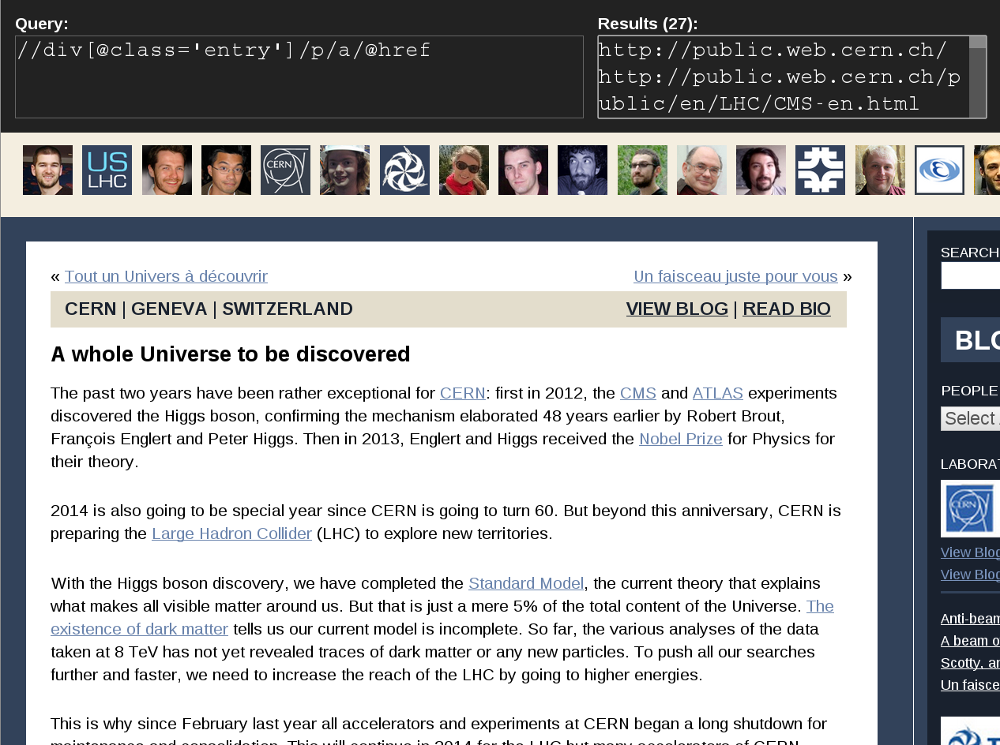

The Crawler
===========

----------------------------------------------------------


----------------------------------------------------------


----------------------------------------------------------

```xml
<rss version="2.0" xmlns:content="http://purl.org/rss/1.0/modules/content/" xmlns:wfw="http://wellformedweb.org/CommentAPI/" xmlns:dc="http://purl.org/dc/elements/1.1/" xmlns:atom="http://www.w3.org/2005/Atom" xmlns:sy="http://purl.org/rss/1.0/modules/syndication/" xmlns:slash="http://purl.org/rss/1.0/modules/slash/">
<channel>
  <title>Quantum Diaries</title>
  <atom:link href="http://www.quantumdiaries.org/feed/" rel="self" type="application/rss+xml" />
  <link>http://www.quantumdiaries.org</link>
  <description>Thoughts on work and life from particle physicists from around the world.</description>
  <lastBuildDate>Tue, 28 Jan 2014 14:21:48 +0000</lastBuildDate>
  <language>en-US</language>
    <sy:updatePeriod>hourly</sy:updatePeriod>
    <sy:updateFrequency>1</sy:updateFrequency>
  <generator>http://wordpress.org/?v=3.7.1</generator>
  <item>
    <title>Anti-beam me up, Scotty!</title>
    <link>http://www.quantumdiaries.org/2014/01/28/anti-beam-me-up-scotty/</link>
    <comments>http://www.quantumdiaries.org/2014/01/28/anti-beam-me-up-scotty/#comments</comments>
    <pubDate>Tue, 28 Jan 2014 13:46:08 +0000</pubDate>
    <dc:creator><![CDATA[CERN]]></dc:creator>
    <guid isPermaLink="false">http://www.quantumdiaries.org/?p=32171</guid>
    <description><![CDATA[While the CERN accelerator complex was being revamped in 2013, the ASACUSA experiment took time to carefully review the data taken in 2012 at the Antiproton Decelerator (AD) facility. This painstaking work paid off and they just announced in Nature having produced the first ever beam of antihydrogen atoms. In laboratory experiments like the ones [&#8230;]]]></description>
    <content:encoded><![CDATA[<p>While the <a href="http://public.web.cern.ch/">CERN</a> <a href="http://www.quantumdiaries.org/2014/01/15/a-whole-universe-to-be-discovered/">accelerator complex was being revamped</a> in 2013, the <a href="http://home.web.cern.ch/about/experiments/asacusa">ASACUSA</a> experiment took time to carefully review the data taken in 2012 at the <a href="http://home.web.cern.ch/about/accelerators/antiproton-decelerator">Antiproton Decelerator</a> (AD) facility. This painstaking work paid off and they just <a href="http://www.nature.com/ncomms/2014/140121/ncomms4089/full/ncomms4089.html">announced in <i>Nature</i></a> having produced the first ever beam of antihydrogen atoms.</p>
    ...
```

----------------------------------------------------------

```xml
<rss version="2.0" xmlns:content="http://purl.org/rss/1.0/modules/content/" xmlns:wfw="http://wellformedweb.org/CommentAPI/" xmlns:dc="http://purl.org/dc/elements/1.1/" xmlns:atom="http://www.w3.org/2005/Atom" xmlns:sy="http://purl.org/rss/1.0/modules/syndication/" xmlns:slash="http://purl.org/rss/1.0/modules/slash/">
<channel>
  <title>Quantum Diaries</title>
  <atom:link href="http://www.quantumdiaries.org/feed/" rel="self" type="application/rss+xml" />
  <link>http://www.quantumdiaries.org</link>
  <description>Thoughts on work and life from particle physicists from around the world.</description>
  <lastBuildDate>Tue, 28 Jan 2014 14:21:48 +0000</lastBuildDate>
  <language>en-US</language>
    <sy:updatePeriod>hourly</sy:updatePeriod>
    <sy:updateFrequency>1</sy:updateFrequency>
  <generator>http://wordpress.org/?v=3.7.1</generator>
  <item>...</item> <item>...</item>
  <item>...</item> <item>...</item>
  <item>...</item> <item>...</item>
  <item>...</item> <item>...</item>
  <item>...</item> <item>...</item>
  <item>...</item> <item>...</item>
  <item>...</item> <item>...</item> 
  <item>...</item> <item>...</item> 
</channel>
</rss>
```

----------------------------------------------------------


----------------------------------------------------------



----------------------------------------------------------

## The algorithm:

1. Find all possible *XPaths* for a given blog

2. Obtain *training data* from the web-feed

3. Execute all *XPaths* on the ~15 latest posts

4. Find the *XPaths* returning results most  
   similar to the training data

----------------------------------------------------------

## Scrapy


----------------------------------------------------------

# Questions?
